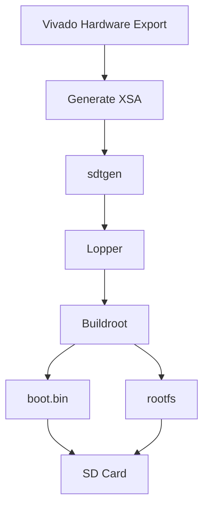

# Buildroot

This page highlights AMD support for Buildroot as an alternative community Linux solution to Yocto.

Unofficial support for AMD architectures (Zynq, Zynq MPSoC, Kria SOMs, and Versal Adaptive SoC) are available. The Buildroot `configs/` directory provides a number of example `defconfig` files for common evaluation boards using AMD devices.

> [!WARNING]
> Buildroot is not WTS supported and should only be used by experienced users.
>
> However, Buildroot uses the same supported software as Yocto from the Xilinx repositories. Any issues with underlying software that can be reproduced using Yocto or Vitis are supported by WTS.
>
> Issues related to configuring Buildroot for custom hardware should be directed to the Buildroot community.

> [!NOTE]
> For Zynq and Zynq MPSoC platforms, the recommended supported boot flow uses FSBL + bootgen rather than the U-Boot SPL flow.

---

# Table of Contents

- [General Information](#general-information)
- [Supported AMD Evaluation Boards](#supported-amd-evaluation-boards)
  - [Zynq](#zynq)
  - [Zynq-UltraScale](#zynq-ultrascale)
  - [Kria SOM](#kria-som)
  - [Versal](#versal)
  - [Versal Gen 2](#versal-gen-2)
- [Getting Started with Buildroot](#getting-started-with-buildroot)
  - [Host System Requirements](#host-system-requirements)
  - [Build Steps](#build-steps)
- [Buildroot Custom Hardware Device Tree](#buildroot-custom-hardware-device-tree)
- [Reference Resources](#reference-resources)

---

# General Information

Official Buildroot release activity and version information can be found at:

- https://buildroot.org/

The following table correlates Buildroot LTS releases with AMD releases.

| AMD Release Tag | Buildroot LTS Release | Linux Kernel LTS |
|---|---|---|
| `xilinx_v2024.2` | `2025.02` | `6.6` |
| `xilinx_v2023.2` | `2024.02` | `6.1` |
| `xilinx_v2022.2` | `2023.02` | `5.15` |

To test newer AMD releases before the next Buildroot LTS release:

```bash
git clone https://gitlab.com/buildroot.org/buildroot.git

Supported AMD Evaluation Boards
Zynq
zynq_zc702_defconfig
zynq_zc706_defconfig
zynq_microzed_defconfig
zynq_zed_defconfig

Zynq UltraScale+
zynqmp_zcu102_defconfig
zynqmp_zcu104_defconfig
zynqmp_zcu106_defconfig

Kria SOM
zynqmp_kria_kd240_defconfig
zynqmp_kria_kr260_defconfig
zynqmp_kria_kv260_defconfig

Versal
versal_vck190_defconfig
versal_vek280_defconfig
versal_vpk120_defconfig
versal_vpk180_defconfig

Versal Gen 2
versal2_vek385_defconfig

Getting Started with Buildroot

This section provides a step-by-step guide for configuring Buildroot to generate an embedded Linux system using AMD Linux releases.

Host System Requirements

See the official Buildroot documentation:

https://buildroot.org/downloads/manual/manual.html
Build Steps
1. Download Buildroot

Download the latest LTS version from:

https://buildroot.org/
2. Review the Buildroot Directory Structure

Key directories include:

configs/

Contains example AMD evaluation board configurations.

board/

Contains example scripts and board-specific files.

Example board directories:
board/zynq
board/zynqmp
board/zynqmp/kria
board/versal
board/versal2

3. Configure Buildroot

Example for ZCU102:
make zynqmp_zcu102_defconfig

4. Build Images
make

5. Inspect Output Images

Generated images are located in:
output/images/

Example contents:
output/images/
├── atf-uboot.ub
├── bl31.bin
├── boot.bin
├── boot.vfat
├── Image
├── rootfs.ext2
├── rootfs.ext4 -> rootfs.ext2
├── sdcard.img
├── system.dtb
├── u-boot.itb
└── zynqmp-zcu102-rev1.0.dtb

6. Flash SD Card
dd if=output/images/sdcard.img of=/dev/sdX

Replace /dev/sdX with the correct SD card device node.

7. Configure Boot Mode

Set the evaluation board to SD boot mode.

8. Login

Default credentials:
Username: root
Password: root

---

# Buildroot Custom Hardware Device Tree

Buildroot expects custom hardware specifications to already be in Device Tree format and does **not** directly support Xilinx XSA files.

To create a device tree for custom hardware, it is recommended to use the supported **Software Hardware Exchange Loop** workflow, which is the same flow used by Yocto.

---

## ZCU102 Example with Custom PL Bitstream

### 1. Generate System Device Tree

Use `sdtgen` to generate the System Device Tree (SDT):

```bash
sdtgen -xsa zcu102.xsa \
       -dir sdt_out \
       -board_dts zynqmp-zcu102-rev1.0
```

This generates:

```text
sdt_out/system-top.dts
```

---

### 2. Clone and Run Lopper

Export required flags:

```bash
export LOPPER_DTC_FLAGS="-b 0 -@"
```

Clone Lopper:

```bash
git clone -b xilinx_v2025.2 https://github.com/Xilinx/lopper.git
```

Create output directory:

```bash
mkdir -p ./lopper_out
```

Run Lopper:

```bash
lopper -f --enhanced \
       ./sdt_out/system-top.dts \
       ./lopper_out/system.dts \
       -- xlnx_overlay_dt cortexa53-zynqmp full
```

Generated output:

```text
lopper_out/system.dts
```

---

### 3. Update Buildroot Configuration

Update the Buildroot board configuration to use the generated DTS.

Example:

```text
configs/zynqmp_zcu102_defconfig
```

Typical kernel configuration updates:

```makefile
BR2_LINUX_KERNEL_CUSTOM_DTS_PATH="board/custom/system.dts"
```

---

## VEK280 Example with Custom `pld.pdi`

For Versal platforms, programmable logic images are packaged as `.pdi` files.

Example workflow:

### Generate Hardware Platform

Export hardware from Vivado:

```text
vek280_custom.xsa
```

---

### Generate SDT

```bash
sdtgen -xsa vek280_custom.xsa \
       -dir sdt_out \
       -board_dts versal-vek280-rev1
```

---

### Process with Lopper

```bash
lopper -f --enhanced \
       ./sdt_out/system-top.dts \
       ./lopper_out/system.dts \
       -- xlnx_overlay_dt cortexa72-versal full
```

---

### Replace PL Programming Image

Copy custom PDI:

```bash
cp custom_pld.pdi output/images/pld.pdi
```

---

### Rebuild SD Card Image

```bash
make
```

Result:

```text
output/images/sdcard.img
```

---

## VEK385 Example with Custom `pld.pdi`

The Versal Gen 2 flow is similar to VEK280.

### Configure Buildroot

```bash
make versal2_vek385_defconfig
```

---

### Generate Device Tree

```bash
sdtgen -xsa vek385_custom.xsa \
       -dir sdt_out \
       -board_dts versal2-vek385-rev1
```

---

### Run Lopper

```bash
lopper -f --enhanced \
       ./sdt_out/system-top.dts \
       ./lopper_out/system.dts \
       -- xlnx_overlay_dt cortexa78-versal2 full
```

---

### Replace Programmable Logic Image

```bash
cp custom_pld.pdi output/images/pld.pdi
```

---

### Regenerate Bootable SD Card Image

```bash
make
```

---

# Output Directory Reference

The following directories are commonly used during Buildroot development.

| Directory | Description |
|---|---|
| `output/build/` | Source trees and temporary package build files |
| `output/host/` | Cross-compilation toolchain |
| `output/images/` | Final bootable artifacts |
| `output/target/` | Root filesystem staging area |
| `dl/` | Downloaded package sources |

---

# Common Build Commands

## Rebuild Entire Project

```bash
make clean
make
```

---

## Rebuild Linux Kernel Only

```bash
make linux-rebuild
```

---

## Rebuild U-Boot Only

```bash
make uboot-rebuild
```

---

## Open Buildroot Menu Configuration

```bash
make menuconfig
```

---

## Open Linux Kernel Configuration

```bash
make linux-menuconfig
```

---

## Save Minimal Defconfig

```bash
make savedefconfig
```

---

# Boot Image Contents

Typical generated boot artifacts include:

| File | Description |
|---|---|
| `boot.bin` | Boot image containing FSBL, PMUFW, ATF, and U-Boot |
| `Image` | Linux kernel image |
| `system.dtb` | Flattened Device Tree |
| `rootfs.ext2` | Root filesystem image |
| `sdcard.img` | Complete SD card image |
| `u-boot.itb` | U-Boot image tree blob |
| `pld.pdi` | Versal programmable logic image |

---

# Typical SD Card Layout

```text
BOOT Partition (FAT32)
├── boot.bin
├── Image
├── system.dtb
├── boot.scr
└── rootfs.cpio

ROOTFS Partition (EXT4)
└── Linux Root Filesystem
```

---

# Troubleshooting

## Missing DTC Compiler

Install Device Tree Compiler:

### Ubuntu/Debian

```bash
sudo apt install device-tree-compiler
```

---

## Buildroot Download Failures

Verify:

- Internet connectivity
- Proxy configuration
- Git access
- Package mirrors

---

## Slow Build Performance

Consider using:

- External toolchains
- Shared `dl/` cache
- `ccache`
- Parallel builds

Example:

```bash
make -j$(nproc)
```

---

# Recommended Workflow



---

# Reference Resources

## Official Documentation

- Buildroot User Manual  
  https://buildroot.org/downloads/manual/manual.html

- Buildroot Releases  
  https://buildroot.org/

---

## AMD / Xilinx Resources

- AMD Adaptive Computing Wiki  
  https://xilinx-wiki.atlassian.net/

- Xilinx GitHub Organization  
  https://github.com/Xilinx

- Lopper Repository  
  https://github.com/Xilinx/lopper

---

# Notes

> [!TIP]
> Buildroot works particularly well for:
>
> - Small embedded Linux systems
> - Fast iterative development
> - Minimal root filesystems
> - Simple BSP maintenance

---

# License

This README is derived from publicly available AMD/Xilinx wiki documentation and reformatted for GitHub compatibility.
